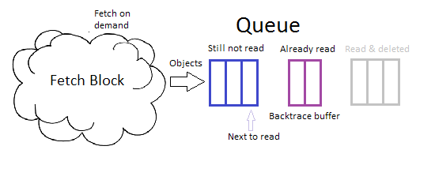

# ParseQueue

The parse queue is a component in the Ruby Compiler Toolkit Project (RCTP). Its
role is to facilitate the movement of language tokens from one compiler phase
(like the lexical analyzer) to the next one (like the parser). More than just a
simple queue, it supports backing up or falling back to earlier states allowing
the parser to try other paths in the syntax tree when one path runs into a
dead end.

The parse queue was created to simplify the design of both the lexical analyzer
and the parser. Parsers often have a built-in limited "look-ahead" of tokens.
This can be seen in parser names like LL(0), LL(1), LR(1), LALR(n), etc. The
parse queue provides for a flexible look-ahead removing this burden from other
compiler components.

The operation of the parse queue is summarized in the following diagram:



## Installation

Add this line to your application's Gemfile:

```ruby
gem 'parse_queue'
```

And then execute:

    $ bundle

Or install it yourself as:

    $ gem install parse_queue

## Usage

The parse queue is designed to be used to bridge phases of the compile process.
In particular the lexical analyzer and the parser.

#### Creating a parse queue:

When creating a parse queue, an optional block parameter is passed in. This is
called whenever more queue items are required. For example:

```ruby
def open_file_tokenized(name)
  txt = IO.readlines(name, nil)[0]
  lex = LexicalAnalayzer.new(text: txt, rules: LEXICAL_RULES)
  ParseQueue.new { lex.get }
end
```
This example above is a method that reads in the named file, creates an
analyzer on it (see the
[lexical_analyzer](https://rubygems.org/gems/lexical_analyzer)
gem for more details) and then uses that as the source for the parse queue.
The queue is returned for use by the compiler's parser.

Note: The constant LEXICAL_RULES is a set of rules used to define the tokens
extracted by the lexical analyzer. As such it is not discussed further here.
See that gem for more details on how rules are constructed.

#### Getting a queued item:

Getting an item from the queue is done with the get method. For example:

```ruby
  item = pq.get
```
This method returns the next unread item from the queue. Note that if no items
are available, the exception **ParseQueueNoFwd** is raised.

Note: The get! method is a get without backtracking. In effect it is a get
followed by a shift (see Shifting below).

```ruby
  item = pq.get!
```

#### Backtracking:

Sometimes while parsing, it is required to backtrack to an earlier point in the
token stream so that an alternative branch of the syntax tree may be processed.
This is often done with the try method.

```ruby
  pq.try {
    do_stuff_with(pq.get)
    # etc

    success
  }
```
Note how the try block returns a value called success. If this value is false
or nil, the parse queue is rolled back to its condition at the start of the try
block. Otherwise, any changes to the parse queue are retained.

Manual control of backtracking is possible by setting the position property to
a value saved off at an earlier point of the processing. For example:

```ruby
  save_point = pq.position
  do_stuff_with(pq.get)
  # etc

  pq.position = save_point unless success
```

#### Shifting

So far, items have been retained in the queue, even after they are done being
processed. For large files, this may use a large amount of memory. To avoid
this, used items need to be shifted out of the parse queue. This can be done as
follows:

```ruby
  pq.try! {
    do_stuff_with(pq.get)
    # etc

    success
  }
```
Note how the try! block returns a value called success. If this value is false
or nil, the parse queue is rolled back to its condition at the start of the
try! block. Otherwise, any changes to the parse queue are retained and
processed items are removed.

This too can be done manually as shown below:

```ruby
  save_point = pq.position
  do_stuff_with(pq.get)
  # etc

  if success
    pq.shift
  else
    pq.position = save_point
  end
```
Note that if an attempt is made to fall back to data that has been shifted out,
a **ParseQueueNoRev** exception is raised.

#### Exceptions

The parse queue uses the following exception classes:

    Exception              # From Ruby.
      StandardError        # From Ruby.
        ParseQueueError    # The abstract root of parse queue exceptions.
          ParseQueueNoFwd  # Error: Can't go forward.
          ParseQueueNoRev  # Error: Can't fall back.

## Contributing

#### Plan A

1. Fork it ( https://github.com/PeterCamilleri/parse_queue/fork )
2. Create your feature branch (`git checkout -b my-new-feature`)
3. Commit your changes (`git commit -am 'Add some feature'`)
4. Push to the branch (`git push origin my-new-feature`)
5. Create a new Pull Request

#### Plan B

Go to the GitHub repository and raise an issue calling attention to some
aspect that could use some TLC or a suggestion or an idea.

## License

The gem is available as open source under the terms of the
[MIT License](./LICENSE.txt).

## Code of Conduct

Everyone interacting in the ParseQueue project’s codebases, issue trackers,
chat rooms and mailing lists is expected to follow the
[code of conduct](./CODE_OF_CONDUCT.md).
